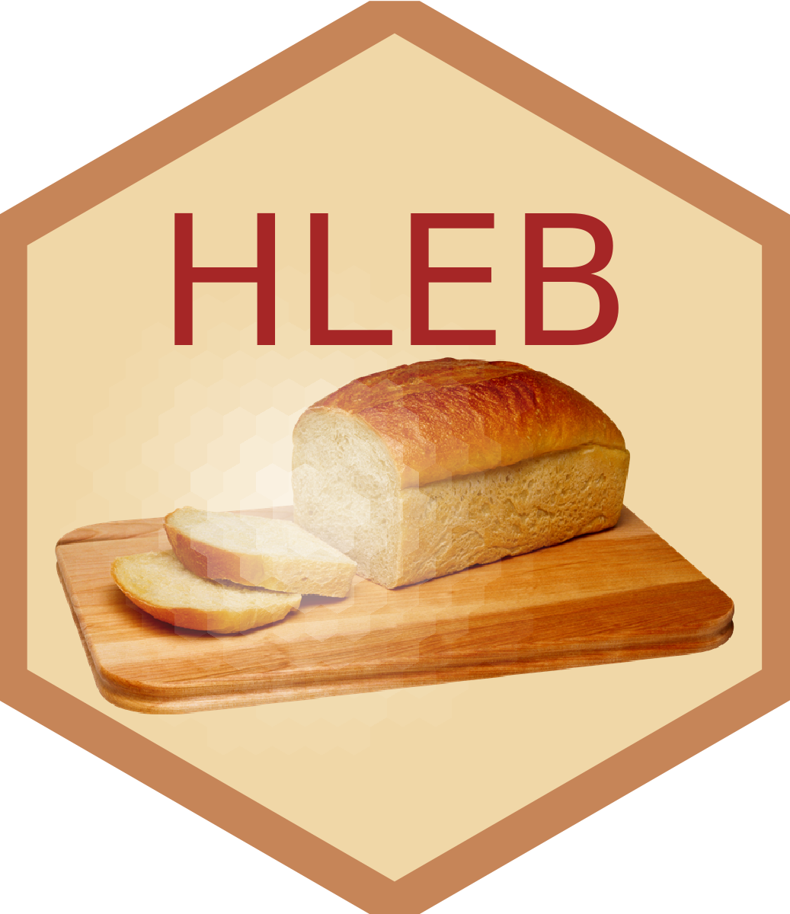

# Half-Life Estimation in a Batch (HLEB)
Repository contains an array of scripts and tools to count base conversion rates from bam files obtaiend from a [Slamseq](https://www.nature.com/articles/nmeth.4435) run.

## Default approach
To run the whole pipeline, one needs to execute ```Master.sh``` script. Run ```bash Master.sh --help``` to get an overview of the available options and arguments.
The standard approach would be:
```bash
 git clone https://github.com/melonheader/HLEB.git
 cd HLEB
 bash Master.sh \
    -i <path_to_bam_files> (wild cards are accepted) \
    -o <output_path> \
    -g <genome_to_use> \
    -a <genome_annotation_to_use> \
    -e <name_of_the_run> \
    -n <numer_of_cores>
```

## Genome annotation
Repository contains a helper script to flatten the GTF annotation for the pipeline. To do so, run:
```bash
 bash collapse_gtf.sh \
    <path_to_gtf> \
    <exon|three_prime_utr> \
    <path_to_write_result>
```
Currently, paths to the genome and annotation are hardcoded. To use this in a fresh installation one needs to change paths on lines 140-142 in ```Master.sh```.
Easiest appraoch would be to create a directory with self-explanatory name for a genome of choice. Then, create a subdirectory called ```slam_annot``` inside. There, put a genome fasta under the name of ```genome_fasta.fa```. Finally, put to the same folder an output of ```bash collapse_gtf.sh``` that was generated from the GTF annotation of the same genome.

## To keep in mind
User needs to provide a path to Varscan binary for SNP quantification. Currently, this can be done by changing the path of the argument -v on the line number 168 in ```Master.sh```. 

